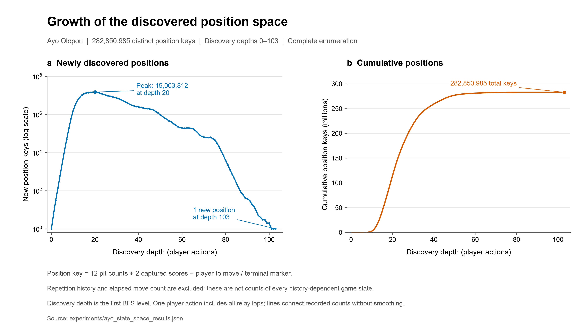
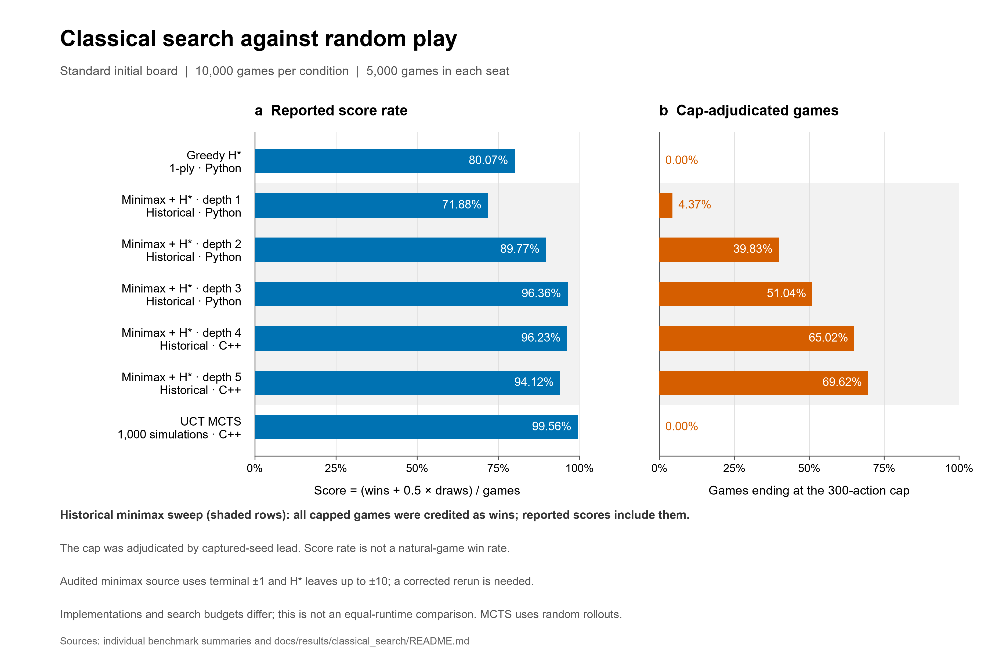
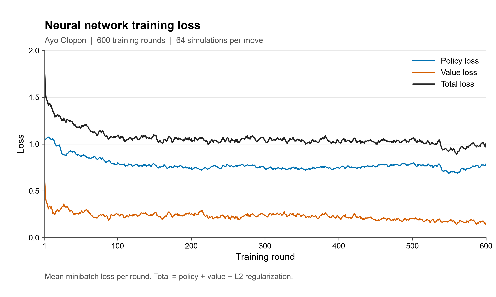
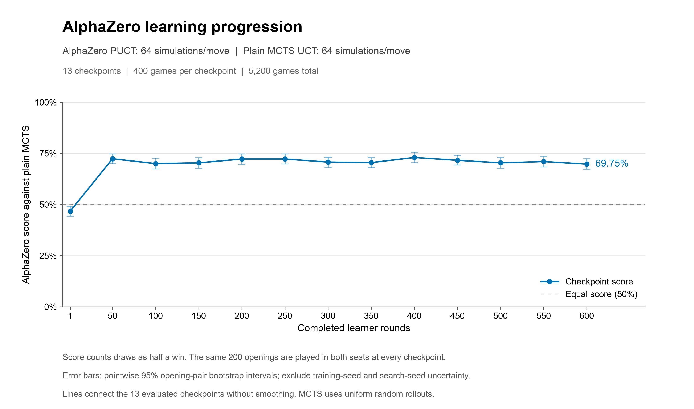
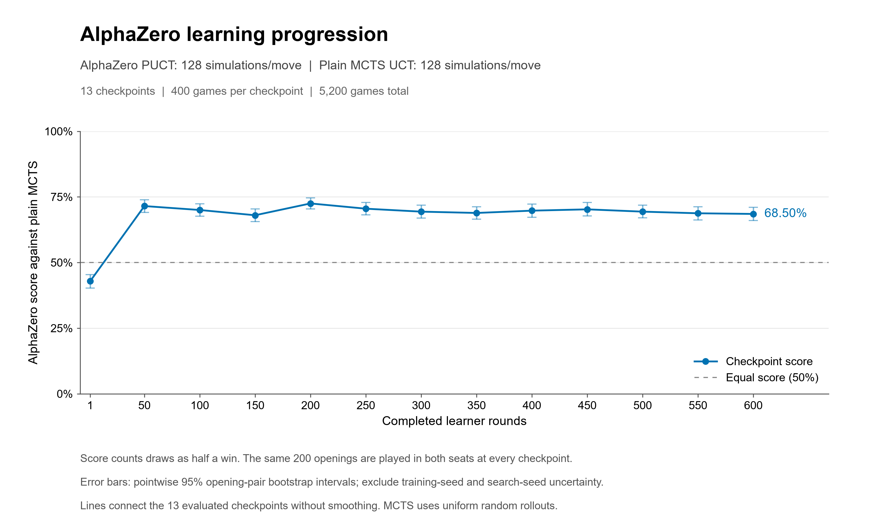
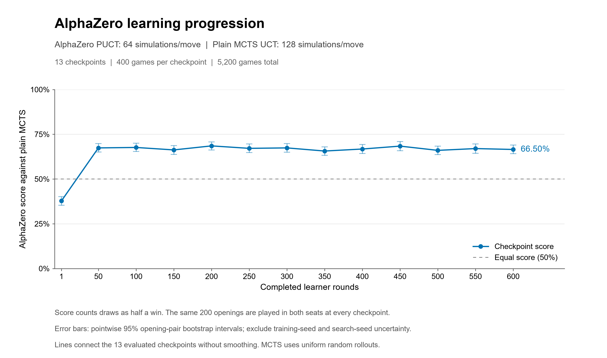
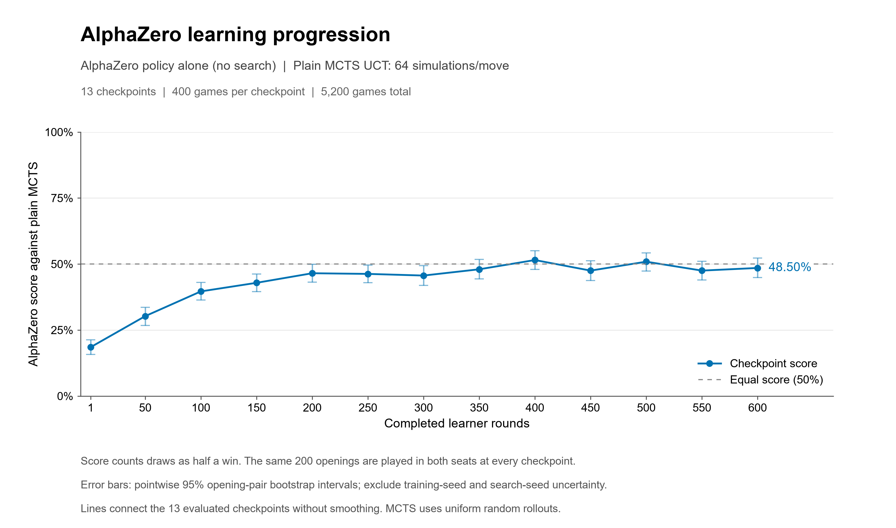

# AlphaAyoOlopon

**Teaching machines to play Ayo Olopon through evaluation, search, and self-play.**

Ayo Olopon has a small board, but a single move can send seeds through several
rounds of relay sowing and change both players' captured scores. Choosing a
good move means reasoning about the position that the whole move leaves behind.

This project explores that problem in stages. We implement the game, measure
the positions our engine can reach, build handcrafted and evolved evaluators,
and test how search changes their play. We then train an AlphaZero agent from
self-play and compare its checkpoints with fixed opponents and with each other.

The implementation uses **OpenSpiel**, with Python and C++ game/search code and
a **JAX/Flax** policy/value network. The experiments are the main story of this
repository; the runners, configurations, and saved records make that story
inspectable.

## Ayo Olopon

The implemented game starts with two rows of six pits, four seeds in every pit,
and 48 seeds in total. Each player controls one row. On a turn, the player
selects a nonempty pit and sows its seeds around the board, skipping the source
pit. If the final seed lands in an occupied pit without making a capture, that
pit is picked up and sowing continues. These relay laps belong to the same turn.

Captures happen when a pit reaches four seeds. While there are seeds left in
hand, the owner of that row receives the capture. A four made by the final seed
belongs to the player making the move. When the opponent's row is empty, a
legal move must feed it. Capturing more than half the seeds wins the game.

For a more detailed explanation of how to play, see
[Teaching Machines to Play Ayo Olopon — Part 1](https://www.davidprincehope.com/blog/teaching-machines-to-play-ayo-olopon-part-1).

The [game model](Model/ayo_olopon/ayo_olopon.py) also resolves repetition,
relay cycles, and positions with no legal moves by awarding the remaining seeds
to the owners of their rows. The training game has a 1,000-action horizon with
the same row-collection adjudication. A search ply counts one player action,
including all its relay laps.

> **Figure 1 placeholder — A relay-sowing move.**
> Show the initial board and selected snapshots of one legal move, with the
> source pit, sowing direction, relay pickup, captured seeds, and player to move
> labelled. Use a recorded engine trace so the illustration follows the
> implemented rules.

## Exploring the game before choosing an agent

Before building a player, we explored the position space with the native C++
engine. The saved enumeration completed with **282,850,985 unique position
keys**, including **6,531,992 terminal positions**, over discovery depths
0 through 103. It generated more than one billion legal transitions.

That count uses pit contents, captured scores, and the player to move or terminal
marker as its identity. It does not distinguish repetition histories or elapsed
move counts. It describes the completed traversal under the enumerator's
position key; it is not a count of every history-dependent game state or a
solution of the game.

The experiment gives a concrete reason to explore selective search and learned
evaluation: even this compact board produces hundreds of millions of distinct
positions. See the [enumeration results](experiments/ayo_state_space_results.json)
and [native build guide](Model/ayo_olopon_C++/README.md).



*Figure 2. Growth of the discovered position space. New position keys at each
discovery depth are shown on a log scale (left), with cumulative keys on a
linear scale (right). The key consists of 12 pit counts, two captured scores,
and the player to move or terminal marker; repetition history and elapsed move
count are excluded. Discovery depth is the first BFS level, with each edge
representing one complete player action, including relay laps. The 104 depth
counts sum to 282,850,985 keys. Lines connect recorded counts without smoothing.*

[Editable SVG, plotted data, and provenance](visualizations/figures/state_space_growth/README.md)
are included with the [source enumeration](experiments/ayo_state_space_results.json).

## Building an evaluator

Our first approach scores a position using quantities the game engine can
calculate directly: captured-seed lead, immediate capture potential, and
mobility. A greedy player applies every legal move to a cloned state and chooses
the successor with the highest score.

After testing candidate feature sets and weights, the selected handcrafted
evaluator was:

$$
H_{\mathrm{CTM}}(s,p)
=4\widehat C(s,p)+2\widehat T(s,p)+0.5\widehat M(s,p).
$$

Here, captured-seed lead and tactical capture potential are normalized by 48,
and mobility by six. Tactical potential and mobility are signed according to
whose turn it is, from player $p$'s perspective. Terminal results use a separate
win/draw/loss score that dominates the nonterminal feature range.

On 30 previously unused verification openings, played in both seats, the
selected greedy evaluator recorded **33 wins, 16 draws, and 11 losses** against
random play: a **68.33% score rate** across 60 games. These are opening-based
verification results. See the [heuristic study](experiments/heuristic/heuristic_summary.md)
for development, selection, and verification details.

Throughout this README, **win rate** is $W/N$, while **score rate** credits a
draw as half a win:

$$
\text{score rate}=\frac{W+0.5D}{N}.
$$

### Evolving the evaluator

We also explored Evolution of Heuristics (EoH): proposing executable scoring
functions, evaluating them against a fixed opponent panel, and evolving a
population using the resulting fitness. The experiment evaluated 85 candidates
across 71,400 development games, followed by 1,080 shortlist-selection games.

The selected evaluator, **H\***, is frozen as `g2-m2-05` in
[H_star.json](experiments/EOH/H_star.json), with its implementation in
[Algorithms/H_star_ayo.py](Algorithms/H_star_ayo.py).
Its selection subset was reused selection data. A later comparison used
400 fresh, frozen openings to compare H* with the handcrafted evaluator.

Both evaluators played each opening in both seats at depths one, two, and three:
800 games per depth, 2,400 games overall. All games ended naturally.

| Lookahead depth | Handcrafted score rate | Evolved H* score rate |
| --- | ---: | ---: |
| 1 ply: evaluate the immediate successor | 39.56% | 60.44% |
| 2 plies: include the opponent's reply | 50.63% | 49.38% |
| 3 plies: include the root player's next move | 45.13% | 54.88% |

H* led at one and three plies; the two-ply result was close to even. The evaluator
and the way it is used in search both matter. These policies use depth-limited
max/min backup without alpha-beta pruning, and their equal outer depth does not
give equal compute: the handcrafted tactical feature examines child states
internally. Opening restoration also resets repetition memory.

The [EoH audit trail](docs/eoh/README.md) and
[400-opening results](experiments/handcrafted_vs_eoh_400/results.md) record the
protocols and their limits.

> **Figure 3 placeholder — Evaluators under different lookahead depths.**
> Plot both evaluators' score rates at depths 1–3 on the same axes, with a
> 50% reference line. Caption: 400 fresh openings, both seats, 800 games per
> depth. Source: `experiments/handcrafted_vs_eoh_400/results_400.json`.
> Keep this comparison separate from EoH development fitness.

## Adding search

A fixed evaluator gives a position a score. Search lets a player examine how
that position might arise and how the opponent might respond.

We tested alpha-beta minimax using H*, and vanilla UCT Monte Carlo Tree Search
using random rollouts. Minimax backs up evaluator scores through a depth-limited
tree. UCT allocates simulations among candidate moves and estimates their
outcomes through playouts.

The following standard-start benchmarks each contain 10,000 games, with 5,000
games in each seat against random play:

| Agent | Budget per move | Win rate | Score rate | Games reaching the action cap |
| --- | --- | ---: | ---: | ---: |
| Greedy H* | 1-ply successor evaluation | 75.66% | 80.07% | 0.00% |
| Minimax + H* | Depth 1 | 66.71% | 71.88% | 4.37% |
| Minimax + H* | Depth 2 | 83.82% | 89.77% | 39.83% |
| Minimax + H* | Depth 3 | 93.07% | 96.36% | 51.04% |
| Minimax + H* | Depth 4 | 92.91% | 96.23% | 65.02% |
| Minimax + H* | Depth 5 | 90.02% | 94.12% | 69.62% |
| UCT MCTS | 1,000 simulations, one random rollout per leaf | 99.20% | 99.56% | 0.00% |

The minimax rows are historical measurements with a 300-action cap scored by
captured-seed lead. Every capped game in the saved sweep was credited as a win;
the cap column is therefore essential to interpreting its reported score.
Source inspection also found that the separate minimax adapter combines
terminal utilities of ±1 with H* estimates as large as ±10. That scale mismatch
needs a corrected rerun before drawing a clean conclusion about search depth.

The MCTS result demonstrates a strong random-opponent baseline at its recorded
budget. These experiments do not form a tournament at equal compute: minimax
depths 1–3 use Python, depths 4–5 use C++, and simulation counts are not time
budgets. Counts and termination categories are documented in the
[source audit](docs/results/classical_search/README.md),
[greedy benchmark](experiments/agent_benchmark/results/random_vs_greedy_hstar_10000.json),
and [MCTS benchmark](experiments/mcts_vs_random/results/mcts_uct_1000sims_games_10000_cpp_summary.json).



*Figure 4. Classical search against random play. Each condition contains 10,000
standard-start games, 5,000 in each seat. Reported score rates (left) include
cap-adjudicated outcomes; the fraction of all games ending at the 300-action
cap is shown separately (right). The historical minimax rows are shaded:
depths 1–3 use Python and depths 4–5 use C++. Every capped minimax game was
credited as a win under captured-seed-lead adjudication. Scores are not
natural-game win rates, and these implementations and budgets do not establish
an equal-runtime comparison. The audited minimax terminal/leaf scale mismatch
requires a corrected rerun before drawing a clean conclusion about depth.*

[Editable SVG, plotted data, individual sources, and provenance](visualizations/figures/classical_search_vs_random/README.md)
are included. The plot uses the individual depth summaries listed in the
[source audit](docs/results/classical_search/README.md).

## Learning through self-play

The next stage replaces the fixed evaluator with a network that learns both
which moves to explore and how promising a position is. Our AlphaZero agent
learns from games against itself. H*, random play, and plain MCTS are evaluation
opponents; their games are not training targets for the reported A100 run.

The network takes a position $s$ and predicts:

- **A policy, $p_\theta(s)$:** probabilities over the six local pit actions,
  with illegal actions masked.
- **A value, $v_\theta(s)$:** the expected win/draw/loss return from the current
  player's perspective.

Neural MCTS uses the policy to guide PUCT exploration and the value to evaluate
leaves. Search produces an improved policy target from root visit counts.
Self-play supplies the final outcome. The learner fits the network to both:

$$
L(\theta)=
\mathbb E_{(s,\pi,z)}
\left[
\bigl(v_\theta(s)-z\bigr)^2
-\sum_a\pi(a\mid s)\log p_\theta(a\mid s)
\right]
+\lambda\sum_{w\in\text{weights}}w^2.
$$

Here, $\pi$ is the search policy and $z$ is the final return from the player
represented by the training position. The implementation uses explicit
weight-only L2 regularization.

The loop is straightforward: play with the current network, save positions and
search policies, sample minibatches from replay, update the policy/value model,
and broadcast the new checkpoint to self-play workers. The
[training guide](experiments/alpha_zero/README.md) describes the implementation,
checkpointing, and resume behavior.

### Network and training settings

The input contains 15 values: the current player's six pits, the opponent's
six pits, both captured scores, and the remaining horizon. Pit and score values
are divided by 48. The observation omits repetition memory; search clones retain
that memory, so the value input is an approximation to the complete game state.

The **185,863-parameter** network is a compact multilayer perceptron:

| Component | Architecture |
| --- | --- |
| Shared trunk | 15 inputs → 256 ReLU → 256 ReLU → 256 ReLU |
| Policy head | 128 ReLU → 6 logits → masked softmax |
| Value head | 64 ReLU → 1 tanh output |

> **Figure 5 placeholder — The Ayo AlphaZero loop.**
> Diagram the 15-feature input, shared trunk, policy/value heads, neural MCTS,
> self-play trajectories, replay buffer, and learner. Show search policies and
> game outcomes returning as training targets, and new weights returning to
> the actors.

The completed A100 experiment reached 600 learner rounds across resumed
sessions. Its principal settings were:

| Setting | Value |
| --- | --- |
| Training hardware | One A100 on Modal |
| Self-play actors | 28 |
| Neural search | 64 simulations per move; PUCT constant 1.5 |
| Root exploration noise | Dirichlet α = 1.0, mixed at 25% during self-play |
| Move sampling | Temperature 1.0 for the first 20 player actions |
| Optimizer | Adam, learning rate 0.001 |
| L2 coefficient | 0.0001 |
| Minibatch size | 128 positions |
| Replay capacity | 16,384 positions |
| Replay reuse setting | 4 |
| Game horizon | 1,000 player actions; collect remaining seeds by row |

The final learner record reports **63,563 self-play trajectories**,
**2,473,058 collected positions**, and **76,608 gradient updates**. Collected
positions are training samples, not distinct states. The run's
[manifest](docs/results/alpha_zero_600/training_manifest.json),
[training summary](docs/results/alpha_zero_600/training_summary.json), and
[Modal guide](experiments/alpha_zero/MODAL.md) preserve its settings and history.

### Training loss



*Figure 6. Recorded policy, value, and total loss across 600 learner rounds.
Each point is the mean minibatch loss across that round's optimizer updates.
The curves are unsmoothed; total loss includes L2 regularization.*

Loss falls rapidly early in the run and then varies around a flatter range.
This describes fitting to the evolving replay data. To assess playing strength,
we also need matches with frozen checkpoints. The
[figure provenance](visualizations/figures/alpha_zero_training_losses_600/figure_provenance.json)
records the source and validation of the plotted values.

## Measuring what the agent learned

### Comparing checkpoints on varied openings

We froze 200 distinct nonterminal positions sampled after 2, 4, 6, 8, or 10
random legal actions. Replaying each saved prefix restores its move count and
repetition history. Each position is played twice with the agents' seats swapped,
giving 400 games per comparison. These are continuation-strength tests; the
agents did not choose the opening moves.

With 64 neural simulations per move for both agents:

| Comparison | Later checkpoint W–D–L | Later checkpoint score | 95% score interval |
| --- | ---: | ---: | ---: |
| C350 versus C50 | 170–112–118 | 56.50% | 53.88–59.13% |
| C600 versus C350 | 154–105–141 | 51.63% | 49.13–54.13% |

C350 scored above even against C50 on this dataset. The later C600–C350
comparison was much closer, and its interval includes 50%. The varied-opening
tests show an earlier improvement while leaving the later improvement uncertain.

Intervals resample whole opening pairs and describe variation in sampled
continuation positions. They do not include training-seed or search-seed
uncertainty. Sources: [C50/C350 report](docs/results/alpha_zero_600/checkpoint-head-to-head-c50-c350-64-20261005/results.json),
[C350/C600 report](docs/results/alpha_zero_600/checkpoint-head-to-head-c350-c600-64-20261005/results.json),
and the [opening dataset guide](experiments/checkpoint_strength/README.md).

### The learned network with and without search

Following the same 200-opening protocol, we compared C600 with vanilla UCT MCTS.
We also tested the policy alone: one network prediction per move, selecting its
highest-probability legal action, with no tree search and no value-based action
selection.

| C600 decision rule | MCTS simulations per move | C600 W–D–L | C600 score | 95% score interval |
| --- | ---: | ---: | ---: | ---: |
| Policy alone | 64 | 141–106–153 | 48.50% | 44.88–52.25% |
| Neural PUCT, 64 simulations | 64 | 230–98–72 | 69.75% | 67.25–72.38% |
| Neural PUCT, 64 simulations | 128 | 219–94–87 | 66.50% | 64.12–69.00% |
| Neural PUCT, 128 simulations | 128 | 228–92–80 | 68.50% | 66.00–71.00% |

Each row contains 400 games, all ending naturally. Against MCTS at 64
simulations, the direct policy scored near even, while the same checkpoint
combined with 64-simulation neural search scored 69.75%. On this benchmark,
the trained network is most useful in combination with search.

The neural and vanilla agents differ in both tree selection and leaf
evaluation: PUCT with learned priors/value versus UCT with random rollouts.
Equal simulation counts do not mean equal runtime. These measurements compare
complete decision rules, rather than isolating the policy or value head.

Saved reports: [policy alone](docs/results/alpha_zero_600/checkpoint-c600-policy-vs-mcts-64-20261005/results.json),
[64 versus 64](docs/results/alpha_zero_600/checkpoint-c600-vs-mcts-64-20261005/results.json),
[64 versus 128](docs/results/alpha_zero_600/checkpoint-c600-64-vs-mcts-128-20261005/results.json),
and [128 versus 128](docs/results/alpha_zero_600/checkpoint-c600-vs-mcts-128-20261005/results.json).

### Checkpoint progression against plain MCTS

The completed progression study applies all four decision rules to **13 frozen
checkpoints: C1 and C50-C600 at 50-round intervals**. Each checkpoint plays 400
games from the same 200 mixed-depth openings, with both seats and identical
paired seeds. Each condition contains 5,200 games; the full study contains
**20,800 games**. All game logs were replayed locally, and scores, paired
intervals, source hashes, and opening schedules were verified before plotting.

| AlphaZero / plain MCTS condition | C1 score | C600 score | Individual progression chart |
| --- | ---: | ---: | --- |
| PUCT 64 / UCT 64 | 46.75% | 69.75% | [64 versus 64](visualizations/figures/mcts_learning_progression_13_checkpoints/puct64-mcts64.png) |
| PUCT 128 / UCT 128 | 42.88% | 68.50% | [128 versus 128](visualizations/figures/mcts_learning_progression_13_checkpoints/puct128-mcts128.png) |
| PUCT 64 / UCT 128 | 37.75% | 66.50% | [64 versus 128](visualizations/figures/mcts_learning_progression_13_checkpoints/puct64-mcts128.png) |
| Policy alone / UCT 64 | 18.50% | 48.50% | [Policy alone versus 64](visualizations/figures/mcts_learning_progression_13_checkpoints/policy-mcts64.png) |









*Figures 7a-d. Four individual training-progression curves, with learner round
on the x-axis and AlphaZero score against plain MCTS on the y-axis. Each point
contains 400 games. All charts share a 0-100% score scale and show pointwise
95% opening-pair bootstrap intervals. Lines connect measured checkpoints
without smoothing. These intervals exclude training-seed and search-seed
uncertainty.*

The search-assisted scores rise sharply between C1 and C50, then fluctuate
through C600. The direct policy improves more gradually, from 18.50% to 48.50%.
These are descriptive patterns from one training run; later learner rounds do
not produce a monotonic increase in the measured search score.

The [full checkpoint table and summaries](docs/results/alpha_zero_600/README.md),
[52 plotted observations](visualizations/figures/mcts_learning_progression_13_checkpoints/chart_data.csv),
[figure provenance](visualizations/figures/mcts_learning_progression_13_checkpoints/figure_provenance.json),
and [experiment protocol](experiments/checkpoint_strength/MCTS_PROGRESSION.md)
are included in the repository. The earlier [individual C600 figures](visualizations/figures/c600_vs_mcts_conditions/README.md)
show the endpoint's outcome distribution. Separate [greedy H* benchmark figures](visualizations/figures/greedy_hstar_benchmarks/README.md)
cover plain MCTS and the mixed-opening checkpoint progression against H*.

## Running the project

Use Python 3.12+ and Git. The current local development environment is CPython
3.14.3 on Windows CPU. Clone with the OpenSpiel submodule:

```sh
git clone --recurse-submodules https://github.com/davidprincehope/AlphaAyoOlopon.git
cd AlphaAyoOlopon
```

For an existing clone, run `git submodule update --init --recursive`.
Create and activate a virtual environment. On Windows PowerShell:

```powershell
python -m venv .venv
.\.venv\Scripts\Activate.ps1
```

On Linux or macOS:

```sh
python3 -m venv .venv
source .venv/bin/activate
```

For the game model and its tests:

```sh
python -m pip install open_spiel numpy pytest
python -m pytest tests/ayo_olopon/test_ayo_olopon.py -q
```

Importing the local model registers the game with PySpiel. Run this example
from the repository root:

```python
import random
import pyspiel
from Model.ayo_olopon import ayo_olopon

game = pyspiel.load_game("ayo_olopon")
state = game.new_initial_state()
print(state)

rng = random.Random(7)
while not state.is_terminal():
    state.apply_action(rng.choice(state.legal_actions()))

print("Captured seeds:", state.captured)
print("Returns:", state.returns())
```

For AlphaZero, install the pinned dependencies, validate the configuration,
and run a one-round pipeline smoke test:

```sh
python -m pip install -r requirements-alpha-zero.txt
python -m experiments.alpha_zero.train --dry-run
python -m experiments.alpha_zero.train --config experiments/alpha_zero/configs/smoke.json
```

The smoke test checks execution. For substantial training, evaluation, and
resume commands, follow the [training guide](experiments/alpha_zero/README.md)
and [Modal GPU guide](experiments/alpha_zero/MODAL.md). The launcher selects
the repository's OpenSpiel Python trainer; the installed package supplies
`pyspiel`. Omitting `--output` creates a timestamped run directory.

For the full Python test suite and figure tools, install the development
requirements. The Modal SDK is included for offline launcher/configuration
tests; those tests do not submit cloud jobs.

```sh
python -m pip install -r requirements-dev.txt
python -B -m pytest tests -q
```

The optional upstream EoH contract tests require the pinned package described
in [the EoH guide](docs/eoh/README.md). They skip when it is not installed.
See [repository maintenance](docs/REPOSITORY_MAINTENANCE.md) for the artifact
policy and the checks to run before publishing changes.

A small greedy H* benchmark can be run separately:

```sh
python -m experiments.agent_benchmark.random_vs_greedy_hstar --games 10 --output-dir runs/agent_benchmark/quickstart
```

Use a fresh output directory to retain previous benchmark records.

## Figures, data, and further reading

The state-space growth, classical search, training-loss, four MCTS progression,
C600 endpoint, and greedy H* figures
are included with plotted data and provenance. Other figures remain explicit
placeholders with proposed captions and sources. The [visualization guide](visualizations/README.md) describes
the experiment-by-experiment workflow and PNG/SVG exports.

The visualization guide lists the dedicated scripts for the reviewed figures.
The superseded generic plotting code and its tests have been archived locally.

Compact [published summaries](docs/results/alpha_zero_600/README.md), frozen
opening datasets, configurations, figure PNG/SVG files, and plotted tables are
included in a fresh clone. Full training runs, checkpoints, replay buffers,
optimizer state, cloud launch metadata, and large per-game traces remain local
and are excluded from Git. The [local data guide](experiments/alpha_zero/LOCAL_DATA.md)
explains the retained artifacts. Figure scripts that recheck raw logs require
those local artifacts. The protocol guides describe how to reproduce the experiments. Different studies use different
opening distributions, compute budgets, and cutoff rules, so their percentages
should be read within their own protocols.

| Resource | Contents |
| --- | --- |
| [Python game model](Model/ayo_olopon/ayo_olopon.py) | Rules, observations, repetition handling, and diagnostics |
| [Native model guide](Model/ayo_olopon_C++/README.md) | C++ build, parity tests, and enumeration |
| [Handcrafted heuristic study](experiments/heuristic/HEURISTIC_METHODOLOGY.md) | Features, selection, and verification |
| [EoH experiment](docs/eoh/README.md) | Evolution, frozen H*, results, and audit trail |
| [400-opening evaluator comparison](experiments/handcrafted_vs_eoh_400/README.md) | Frozen evaluators at three lookahead depths |
| [Native MCTS benchmark](experiments/mcts_vs_random/README_native.md) | UCT and random-rollout configuration |
| [AlphaZero training](experiments/alpha_zero/README.md) | Model, self-play, checkpoints, tests, and resume |
| [Checkpoint comparisons](experiments/checkpoint_strength/README.md) | Opening datasets, head-to-head matches, and uncertainty |

## Repository layout

```text
Algorithms/       Search agents, evaluators, and AlphaZero adapters
Model/            Python game models, replay viewer, and native C++ Ayo model
experiments/      Experiment runners, configurations, datasets, and guides
open_spiel/       OpenSpiel fork (Git submodule)
tests/            Python and C++ validation suites
visualizations/   Result loaders and research figure scripts
docs/             Methodology, audit trails, and result summaries
Resources/        Reference papers
runs/             Local training and evaluation artifacts
```

## License

This repository does not currently include a top-level license. The OpenSpiel
submodule includes its own [Apache 2.0 license](open_spiel/LICENSE).
